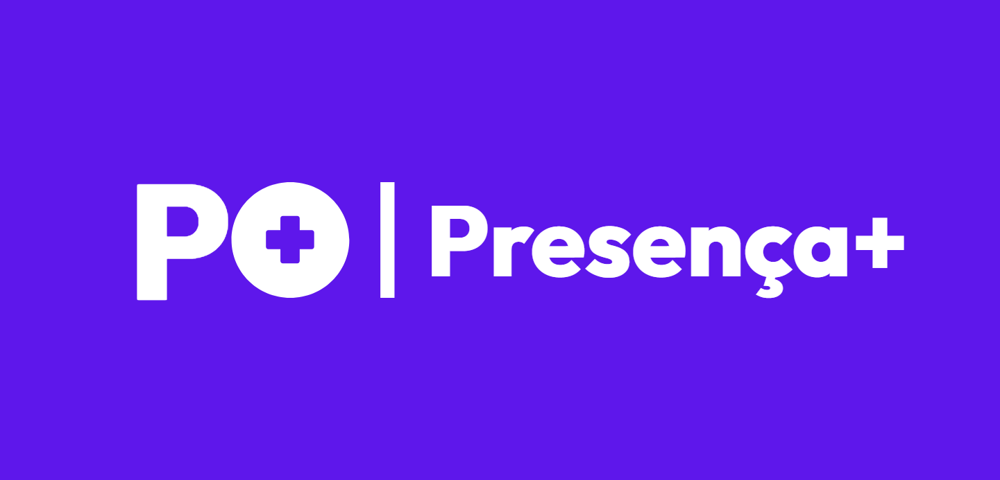

# Presença Mais

> **Presença Mais** é um projeto voltado para o controle e gerenciamento de presença de forma simples e acessível.  
> O objetivo é facilitar o registro, a visualização e a organização de informações, oferecendo uma solução prática e intuitiva para o usuário.

---

Reportagem da **Globo** sobre o projeto: 
[G1|Globo](https://g1.globo.com/pe/pernambuco/ne2/video/estudantes-de-escola-publica-de-igarassu-desenvolvem-sistema-para-combater-evasao-escolar-14106197.ghtml?utm_source=ig&utm_medium=social&utm_content=link_in_bio&fbclid=PAb21jcAPc7DBleHRuA2FlbQIxMQBzcnRjBmFwcF9pZA81NjcwNjczNDMzNTI0MjcAAae3d84khK-vaAfpQVuXdlLg3Kn7SOLKODcjJybc1v_mxhcdmGc_uyz0PRynzg_aem_SEda61tGxC41a9GQwiTUQg)

## 📄 Licença

Este projeto está licenciado sob a **Creative Commons BY-NC-ND 4.0**.  
Você pode utilizar e compartilhar o conteúdo, desde que atribua o autor, não o utilize para fins comerciais e não crie obras derivadas.

🔗 Veja mais detalhes em:  
[https://creativecommons.org/licenses/by-nc-nd/4.0/deed.pt-br](https://creativecommons.org/licenses/by-nc-nd/4.0/deed.pt-br)

---

## 🌐 Links

- **Wole:** 
https://www.instagram.com/wole.br?igsh=djVnaHlkemtiaWp6
